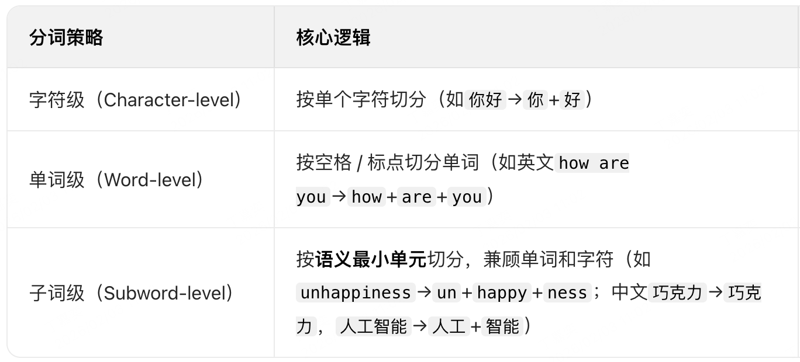
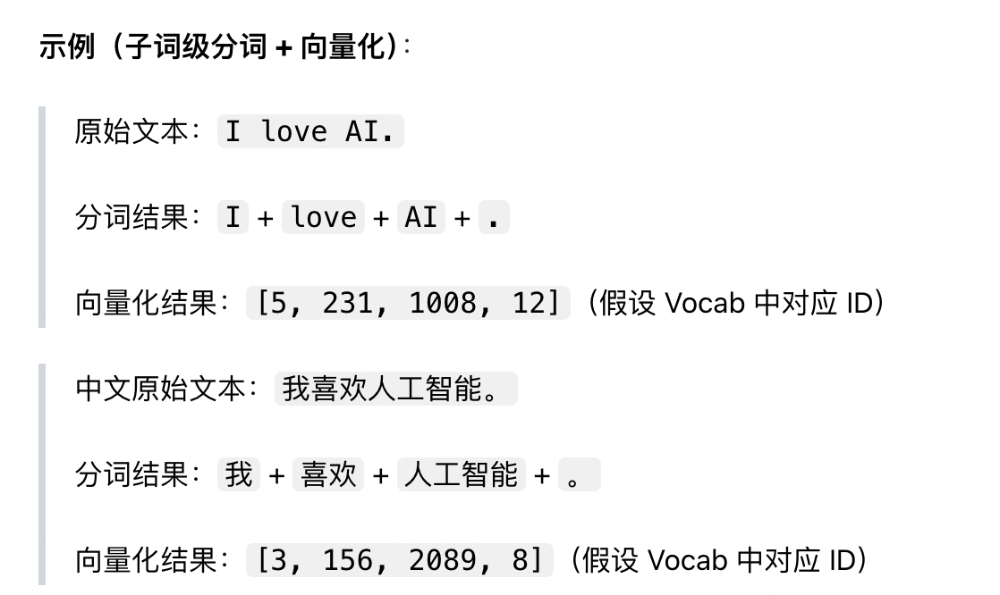

## Tokenizer
1. 文本预处理（Preprocessing）
对原始文本做清洗和标准化，消除无意义差异，保证输入一致性：
大小写统一（如Hello→hello，视模型配置而定）
标点符号分离（如Hello,→Hello + ,）
特殊字符处理（如换行、空格、表情、URL 的统一编码 / 过滤）
中文无天然分隔符，此步骤会额外做空白符清理等。
2. 分词（Tokenization）
将预处理后的文本切分为最小的语义单元（Token），这是 Tokenizer 的核心步骤，不同模型采用不同的分词策略，主流有 3 类：

3. 向量化（Vectorization）
为每个切分好的Token分配一个唯一的数字 ID（词汇表 Vocab 映射），最终将文本转换为数字序列，成为模型的输入。
同时会生成词汇表（Vocabulary/Vocab）：Tokenizer 训练好的 “Token - 数字 ID” 映射表，模型的 Vocab 大小决定了可识别的 Token 数量（如 GPT-3 的 Vocab 约 50k，LLaMA-2 的 Vocab 约 32k）。
补充特殊 Token：会在 Vocab 中加入模型所需的特殊标识，如`<pad>`（补全）、`<unk>`（未登录词）、`<bos>`（句子开始）、`<eos>`（句子结束）等。
