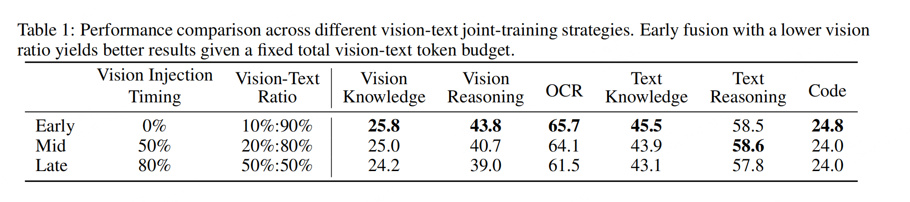
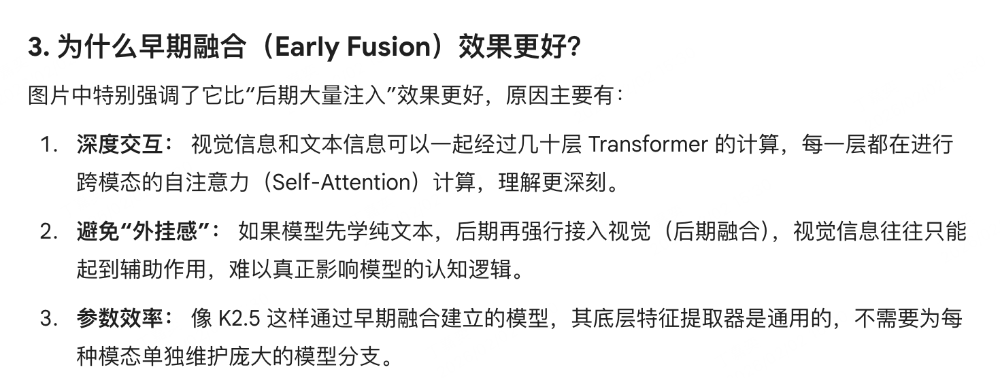

# Kimi K2.5 NOTES
Multimodal Agentic Model
MoonViT-3D
## 1.Joint Optimization of Text and Vision

【看完这里回过头记得写点总结】

### 1.1 Native Multimodal Pre-Training

- 在“固定总 vision+text token 预算”下，**早期融合（early fusion）且较低的视觉比例**比在训练后期大量注入视觉数据效果更好；因此 K2.5 在整个预训练过程保持恒定的视文本混合比。

### 1.2 Zero-Vision SFT
zero-vision SFT = 使用纯文本的监督微调（SFT）数据来“激活”模型的视觉与工具调用能力，而不直接用大量真实图像作为 SFT 数据。图像相关操作由可执行/程序化文本（如 IPython 中的图像处理步骤）代理，从而让模型学会视觉推理的轨迹与工具调用流程。

具体来说，步骤如下：
1. 把图像操作用程序化步骤在**文本里描述**（例如：“在 IPython 中对图片做二值化、计数、裁剪”并给出期望输出）；这些文本轨迹作为训练样本。
1. 在后续用 outcome-based visual RL 微调需要视觉理解的任务（visual grounding/counting/OCR 等），用真实视觉数据继续训练以提升性能。
1. Paper 的实验显示：zero-vision SFT 起点后，视觉 RL FLOPs 上升仍能持续改进；而直接 text-vision SFT（在 SFT 阶段直接加入视觉样本）反而可能降低泛化，**可能是因为视觉 SFT 数据质量不足或过拟合视觉轨迹**。

- [ ] 为什么这么做？

1. 文本 SFT 数据丰富且多样，真实高质量视觉 SFT 数据稀缺且昂贵。
2. 这激活了模型把视觉问题转化为“代码问题”的能力。比如，它想数图里有多少个球，它会写一段 Python 代码去识别像素块 。在 joint pretraining（文本+视觉已建立对齐）的基础上，文本SFT 能触发模型内部的视文对齐能力（模型能把文本描述的视觉操作映射到已学的视觉表征/推理路径）。
3. 为后续视觉 RL 提供一个良好cold-start；paper 发现 **zero-vision SFT 后接视觉 RL 能快速提升视觉能力**。

### 1.3 Joint Multimodal Reinforcement Learning (RL)
这里的RL主要分为3个部分：1.Outcome-Based Visual RL+ 2.Visual RL（显著提升文本任务表现） + 3.Joint Multimodal RL（可以同时读取文本和视觉数据来训练）
**Outcome-Based Visual RL**：基于结果RFT，选最优的结果SFT
**Visual RL**：用visual RL可以提升文本reasoning能力
**joint Multimodal RL**：按能力划分域专家：不按模态（text/vision）分割训练集，而按能力（knowledge、reasoning、coding、agentic 等）组织任务，域专家**同时接触纯文本与多模态查询**。统一奖励模型（GRM）：使用 Generative Reward Models 对异构轨迹进行细粒度评价，补充规则化 outcome reward，尤其用于开放式生成与主观质量评价。

- [ ] **为什么“视觉”能让推理更强？**
报告中有一个非常有趣的发现：视觉训练居然能提高文字推理能力 。
逻辑链条： 传统的文字模型容易“瞎编”数字或逻辑。但在视觉任务（比如 OCR 文字识别、数数、读图表）中，答案是非常明确的（图里有 5 个苹果就是 5 个，代码写错一个像素就画不出圆） 。
结果： 这种严苛的视觉反馈，让 AI 学会了更加脚踏实地地思考，减少了“幻觉” 。

- [ ] **什么是 RFT (Rejection Fine-Tuning)？**
简单来说，这是一种“优中选优”的筛选机制：
采样 (Sampling)：让模型针对一个问题生成很多个不同的答案（路径）。
验证 (Verification)：用外部工具（比如 Python 解释器、数学公式验证器、或者预设的 Ground Truth）去检查哪些答案是对的。
微调 (Fine-Tuning)：只把那些正确且逻辑清晰的路径拿出来，喂回给模型进行微调。

## Agent Swarm
Orchestrator & Sub-agents
**Orchestrator：** 是在“应用层”把一个大任务拆成几个小任务，分给不同的“子智能体”去干。比如：一个子智能体去爬网页，一个去跑 Python 代码。它是宏观的、任务级的，主要为了并行协作和处理超长信息（比如报告里说的 40GB 视频）。
**Sub Agents 的独立性：** 论文提到子智能体是独立运行的。如果你是那个 Main Agent，在收集了 32 个视频片段的分析结果后，你最担心的“冲突”可能是什么？（提示：如果有两个子智能体对同一段剧情有不同的解读，总管该听谁的？）
- [ ] **Main Agent 最担心的冲突**
假设两个子 Agent 分析同一段剧情：
Agent A（擅长情感分析）："这段对话暗示角色内心挣扎，是悲剧伏笔"
Agent B（擅长情节逻辑）："这段对话只是推动剧情发展，属于常规叙事"
冲突本质
这不是"谁对谁错"的事实冲突，而是 "分析框架不同导致的意义建构冲突"。
*作为 Main Agent 的解决思路*
1. 元信息加权：评估每个子 Agent 在其擅长领域的置信度
1. 冲突结构化：不是二选一，而是"Agent A 从情感角度发现 X，Agent B 从情节角度发现 Y，两者可共存"
1. 上下文仲裁：根据任务目标判断当前更需要情感洞察还是情节梳理
1. 保留歧义：若证据不足，输出多视角分析而非强行统一
核心原则：子 Agent 的独立性是优势（多样性），Main Agent 的价值在于整合而非压制这种多样性。
